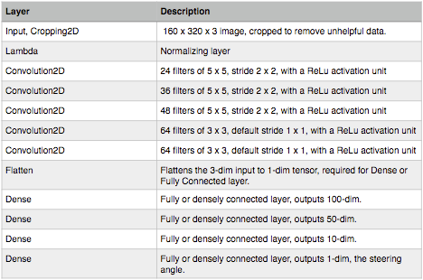

## Driving Behavior Cloner
### Preet Singh 
This repository contains my work on Udacity’s Behavior Cloning project in their Self-Driving Car program, The python notebook contains the code to train a convolutional neural net pipeline on user-recorded driving data in a simulator. The model outputs steering values which can be fed back to the simulator so the car can ‘drive’. A video, **video.mp4** of the neural-net system ‘driving’ the car is also included in the repository.  

**Environment:** Python 3, Keras + TensorFlow, OpenCV

### Getting started 
If you have access to the simulator, you can record your own data. If not, download the data from [here](https://d17h27t6h515a5.cloudfront.net/topher/2016/December/584f6edd_data/data.zip). Instructions and code for extracting the data and training the network are given in the notebook model.ipynb . 

### Data 
The data contains a folder of images called IMG (correspond to a video of user-recorded driving data on a simulator) and driving_log.csv containing the following columns: 'center', 'left', 'right', 'steer', 'throttle', 'brake', 'speed’. The first 3 refer to images from 3 dashboard cameras in various positions. The rest correspond to values recorded at that time. Images are 160 x 320 x 3. 

### Model Architecture

### Further Model details
I’ve chosen an Epoch length of 10, a batch size of 128 and mean-squared error for my loss function. I also use an Adam optimizer instead of say, Stochastic Gradient Descent. 
 

### Additional details : 
We have three images provided in the dataset but two are entirely superfluous - I’ve used these to augment the data. However all 3 correspond to the same steering angle. I’ve treated the left and right images as those from the center camera, so they should have slightly different steering values. The steering angle from the POV of the right-camera > steering angle from the center-camera > steering angle from the left-camera. I’ve set a displacement value to be the standard deviation of the steering angle (0.16) but feel free to change this parameter.

